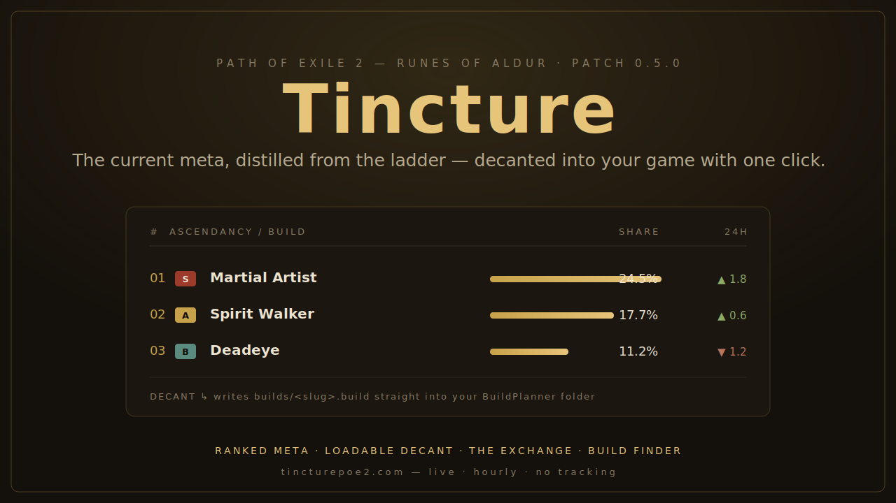

# Tincture

**The current Path of Exile 2 meta, distilled from the ladder and decanted into your game with one click.**

Tincture reads what the top of the live ladder is actually playing, boils thousands of characters down to one ranked list, visualizes the whole meta, and lets you export any pick as a labelled starting template in one click. It auto-refreshes every hour, so it's never out of date. (Loadable one-click builds — straight into your in-game Build Planner — are the next milestone; we don't fake a `.build` the game would silently refuse.)

> Built for the **Runes of Aldur** league (PoE 2 patch 0.5.0). It's a single static page plus a tiny Python pipeline — no backend, no database, no tracking.



<!-- Placeholder above. Record a short walkthrough, save it as docs/demo.gif,
     and swap the line above to:  -->

---

## Why it's different

The big sites are planners and raw stat dashboards. Tincture is a **discovery** tool with one job: get you from "what should I play?" to a confident starting point, fast — and it's honest about exactly what it knows.

- **Distilled, not dumped.** poe.ninja shows you the full spread of ladder data. Tincture serves the consensus — ranked, tiered, each row carrying an editorial playstyle note and a sample-confidence cue, with 24-hour trend arrows that light up once a day of snapshots has accumulated.
- **The whole meta, visualized.** *The Assay* charts class composition, ascendancy shares, meta concentration (HHI + effective ascendancies), tier spread, and a cross-league comparison — all hand-rolled SVG, no libraries, computed in your browser.
- **All the data, yours.** *The Cellar* lays every build across every league in one sortable table, shows the raw `data.json`, and exports CSV/JSON. The same static file the page reads is the public "API" — no backend, no key.
- **One-click Decant (honest about it).** Decant exports a labelled meta template — ascendancy, ladder share, sample, playstyle, guide pointer — via the [File System Access API](https://developer.mozilla.org/en-US/docs/Web/API/File_System_API) or a download. It's a starting pointer, **not** a loadable `.build`; the game silently refuses malformed files, so we don't fabricate one. Loadable builds land with the GGG character pull.
- **Never stale.** A scheduled job re-distills the meta every hour, **validates** the result, and commits only if it passes. The page just reads it.

---

## How it works

```
poe.ninja PoE2 build API  ──►  scripts/distill.py  ──►  data.json  ──►  index.html
   (ladder-derived meta)       (hourly, via Actions)     (committed)     (static page)
```

1. **`scripts/distill.py`** pulls the current league's build aggregation from poe.ninja (which is itself derived from GGG's official ladder — the top 15,000 characters), normalizes it, assigns tiers, and computes each build's 24-hour movement by diffing the previous snapshot.
2. The result is written to **`data.json`** in the front end's exact schema.
3. **`.github/workflows/distill.yml`** runs that hourly and commits `data.json` when the meta moves.
4. **`index.html`** reads `data.json` (falling back to bundled sample data if it's missing), renders the ledger, and handles Decant entirely client-side.

It's stdlib-only Python — no dependencies to install — and it **fails safe**: if poe.ninja errors or returns something unexpected, the previous `data.json` is left untouched so the site never breaks.

---

## Project layout

```
Tincture/
├── index.html                  # the whole front end (HTML + CSS + JS, no build step)
├── data.json                   # the distilled meta (committed by the pipeline)
├── SCHEMA.md                   # the reverse-engineered .build file format
├── scripts/
│   ├── distill.py              # the distillation engine (meta -> data.json)
│   ├── buildfile.py            # .build serializer + validator (+ is_loadable guard)
│   ├── test_distill.py         # stdlib unit tests — the honesty invariants
│   └── ggg.py                  # GGG API client: ladder character -> .build
├── .github/workflows/
│   ├── distill.yml             # hourly refresh — validates, then commits if it passes
│   └── test.yml                # runs the test suite on code changes
├── LICENSE
└── README.md
```

---

## Run it locally

No dependencies. Python 3.9+.

```bash
# Full pipeline on bundled sample data (no network) — writes data.json:
python scripts/distill.py --demo

# Probe the live source — prints the leagues + top ascendancies it returns:
python scripts/distill.py --probe

# A real run (what the Action does):
python scripts/distill.py

# Run the test suite (stdlib unittest — no network, no pip):
python scripts/test_distill.py
python scripts/buildfile.py --selftest
```

To view the site, serve the folder and open it (the File System Access API needs `http`/`https`, not `file://`):

```bash
python -m http.server 8000   # then open http://localhost:8000
```

---

## Deploy (GitHub Pages)

1. Push this folder to a public repo.
2. **Settings → Pages → Build and deployment → Deploy from a branch → `main` / root.** It'll be live at `https://<you>.github.io/Tincture/`.
3. **Settings → Actions → General → Workflow permissions → Read and write.** (Lets the hourly job commit `data.json`.)
4. **Actions tab → Distill the meta → Run workflow** once to populate fresh data immediately.

> The one-click folder save works on the deployed HTTPS site in Chromium browsers (Chrome, Edge, Brave, Opera). Firefox/Safari fall back to a normal download with a "move it here" note.

---

## The live data source

The meta comes from poe.ninja's (undocumented but stable) PoE 2 endpoint
**`GET /poe2/api/data/build-index-state`**, wired up in `scripts/distill.py`. It
returns each current league's most-played ascendancies with a share-of-ladder %
and a trend flag. `distill.py` picks the softcore **Runes of Aldur** league
(`leagueUrl: runesofaldur`), maps each ascendancy to its base class, reconstructs
per-ascendancy character counts from the league total, tiers them, and diffs
against the previous snapshot for the 24-hour trend arrows. It needs no auth and
answers bare requests, so the GitHub Action fetches it directly.

Run `python scripts/distill.py --probe` to see exactly what it returns.

> poe.ninja ranks **ascendancies**, not individual skills, so the ledger headlines
> the ascendancy; the per-build "signature skill" arrives with the GGG character
> pull (below).

---

## Roadmap

- [x] Decode the `.build` format ([SCHEMA.md](SCHEMA.md)) + a validated serializer (`scripts/buildfile.py`)
- [x] Live meta from poe.ninja's `build-index-state` (ascendancy shares + 24h trend)
- [x] League switcher — Softcore / Hardcore / SSF / HC SSF + Standard (dropdown)
- [x] **The Assay** — class composition, ascendancy shares, meta concentration (HHI + effective ascendancies), tier spread, cross-league comparison (hand-rolled SVG)
- [x] **The Cellar** — every build across every league in one sortable table, raw `data.json` view, CSV/JSON export, open-data docs
- [x] Ledger enrichment — editorial playstyle tags, sample-confidence cue, honest "baseline" trends, top-N coverage footnote
- [x] **Honest Decant** — exports a labelled meta template (`.txt`), never a fabricated `.build`; serves a real `.build` automatically once one exists
- [x] Test suite + CI — stdlib invariants (`scripts/test_distill.py`), and the hourly distill validates its output before committing
- [ ] **Real Decant content** — pull a representative public ladder character via GGG's Character API, run it through the serializer, and commit `builds/<slug>.build` (the page already fetches those first, falling back to the template)
- [ ] Complete the ascendancy → `.build` code table (only `Martial Artist → Monk1` is confirmed)
- [ ] **Direct GGG ladder cross-check** — a second source so the meta isn't single-sourced
- [ ] A guide directory — link out to the best community guide for each meta build

---

## Credits & disclaimer

Meta data via [poe.ninja](https://poe.ninja), derived from Grinding Gear Games' official ladder.

Tincture is an independent fan project and is **not affiliated with or endorsed by Grinding Gear Games**. Build files are player-driven; GGG does not curate or rank them. Judge a build on its merits before committing a league to it.

## License

MIT — see [LICENSE](LICENSE).
